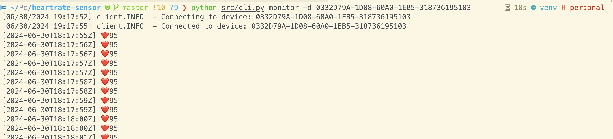
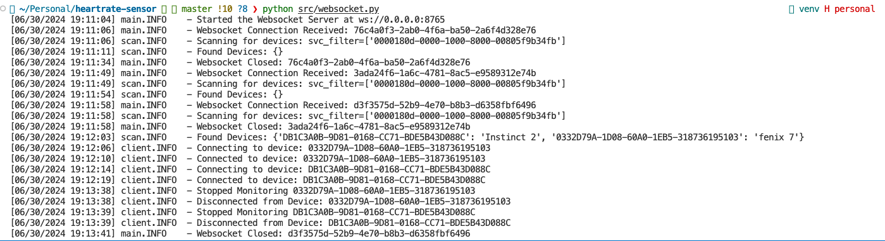
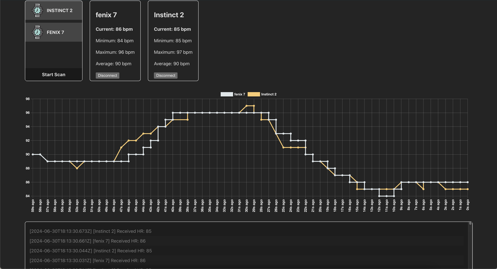

# HR Sensor

A Monorepo of a BLE Heart Rate Broadcast Receiver. Containing isolated library code, and two interfaces in the form of a CLI tool and a websocket server for further integration into web applications.

## CLI Tool
The CLI tooling offers the ability to identify nearby devices, and inspect what servers / characteristics they expose. It can also monitor the Heartrate and expose that data via multiple outputs, such as STDOUT or via FILE.
The FILE output, can then be read in as a stream to software such as OBS to provide realtime HR tracking overlays onto Live Video.



#### Example Usage
```shell
# Scan nearby discoverable devices, and list of the found device name & device address
python src/cli.py scan

# Monitor Heart Rate broadcasted from a specific device
python src/cli.py monitor -d <DEVICE_ADDR>

# Monitor Heart Rate broadcasted from a specific device, and write to file (for use by other programs)
python src/cli.py monitor -d <DEVICE_ADDR> -o file

# (DEV) List out services/characteristics of a device
python src/cli.py describe -d <DEVICE_ADDR>
```

## Websocket Server
The websocket server, allows for interacting with the BLE devices from web applications. Providing much richer user experiences, and removes the locality bottleneck of BLE. Users across the world, can issue commands or monitor data sent out by the device.



#### Websocket CLI Interface
The websocket server interface is fairly simple, it exposes 2 parameters:

Purpose | Parameter | Short Flag | Data Type | Default
--- | --- | --- | --- | ---
Host the server will listen on | `--host` | `-H` | String | `0.0.0.0`
Port the server will listen on | `--port` | `-P` | Int | `8765`


#### Commands To The Websocket Server
Command | Example Return Structure | Description
--- | --- | ---
`scan` | Scanned Devices | This scans for all nearby devices
`connect:<DEVICE_ADDR>` | HR Reading |  This connects to a specific device, and adds a listener for broadcasts HR readings
`disconnect:<DEVICE_ADDR>` | N/A | This disconnects from a specific device | N/A

#### Responses To The Clients
Event | Example Structure | Description
--- | --- | ---
HR Reading | `{action: 'hr', hr: 75, date: '2024-02-02T02:02:02'}` | Heart Rate reading broadcasts from the device
Scanned Devices | `{ action: 'devices', devices: [...]}` | Devices found in the device scan


#### Examples
```shell
# Start the server
python src/websocket.py 

# Start the server on a custom port
python src/websocket.py -p 8080
```

## Example - Website
This is a small Vue application, that interacts with the websocket server. To provide tracking and graphing of multiple BLE devices. See more information in the README file in the example directory

