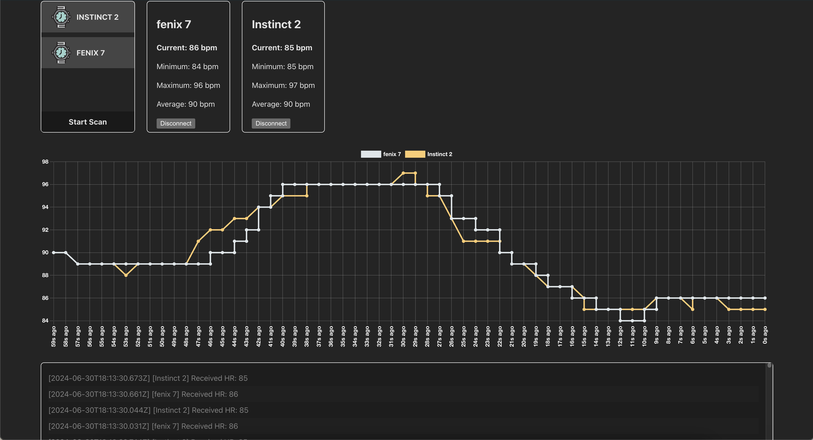

# Website Example - BLE HR SENSOR

A Simple VUE.js application, to communicate with a python websocket server. Handles connection management for multiple BLE devices, offers graphing functionality, and statistics aggregation. 



## Features
- Realtime websocket communication
- Multi device support
- Sliding Window Graphing
- HR Aggregation
- Reconnection on socket connection errors


## Usage
There are two components to this example, the frontend (Vite/Vue) and the backend (Python Websocket).
```shell
# In Terminal 1 (Backend):
cd <project_root>;
python -m venv .venv && source .venv/bin/activate
pip install -r requirements.txt
python src/websocket.py

# In Terminal 2 (Frontend):
cd <project_root>/examples/website;
npm ci; npm run dev
```